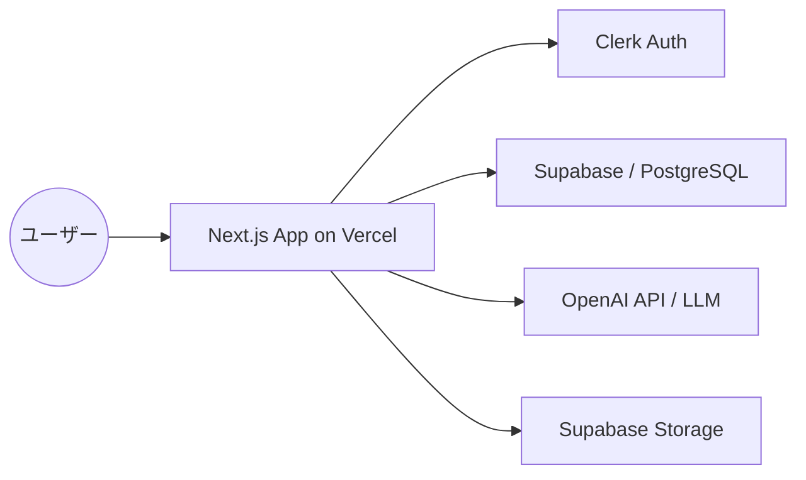
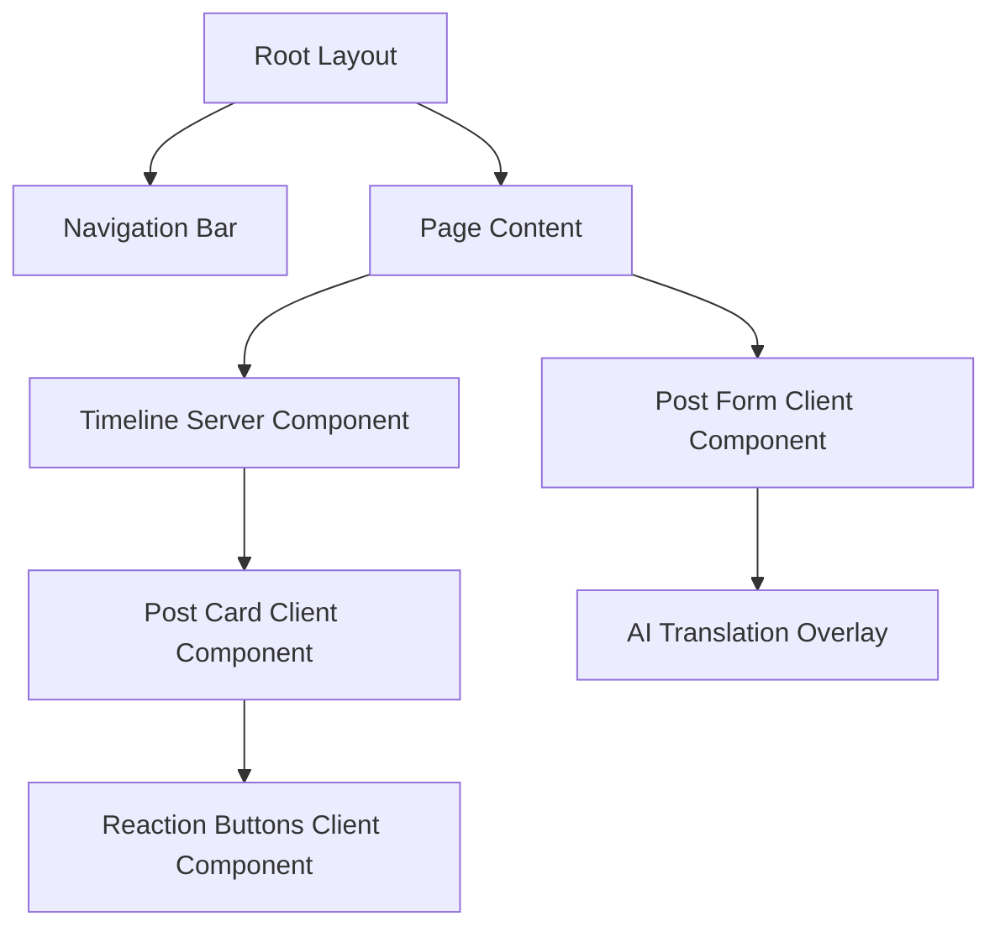

# システムアーキテクチャ設計

## 1. 技術スタック

本プロジェクトでは、開発スピード、スケーラビリティ、および世界観の維持（プロンプト管理等）を重視し、以下のモダンな技術スタックを採用します。

| レイヤー | 技術 | 選定理由 |
| :--- | :--- | :--- |
| **フロントエンド** | Next.js (App Router) | 高速なレンダリング、SEO（将来用）、および開発効率の高さ。 |
| **言語** | TypeScript | 型安全性による保守性の向上。 |
| **スタイリング** | Tailwind CSS | 迅速なUI構築とカスタマイズ性。 |
| **認証** | Clerk | 認証基盤の構築コスト削減、ユーザー管理の容易さ。 |
| **データベース** | Supabase (PostgreSQL) | リアルタイム性、RLSによるセキュリティ、開発の容易さ。 |
| **AI (翻訳/検閲)** | OpenAI API (gpt-4o-mini) | 高精度な文脈理解とコスト効率のバランス。 |
| **ホスティング** | Vercel | Next.jsとの親和性、CI/CD環境の自動化。 |

## 2. アーキテクチャ概要図

### コンポーネントの役割
- **Next.js (Vercel)**: フロントエンドUI、API Routes（サーバーサイドロジック）、およびAI連携のオーケストレーション。
- **Clerk**: ユーザーのサインイン/サインアップ、セッション管理を担当。
- **Supabase**: 投稿データ、動物人格プロファイル、称号実績、および翻訳プロンプトテンプレートの保存。RLS（Row Level Security）により、本人のみが原文にアクセスできる環境を構築。
- **OpenAI API**: ユーザーの入力を受け取り、プロンプトテンプレートに基づいて「動物の言葉」に翻訳。

## 3. コンポーネント設計 (Next.js App Router)

### 3.1 コンポーネント階層と役割分担

### 3.2 主要コンポーネント定義

1.  **Post Card (Client Component)**
    - **Props**: `post_id`, `translated_content`, `nickname`, `title`, `initial_reactions`
    - **役割**: 翻訳された投稿の表示、および「しぐさリアクション」の状態管理。
    - **状態管理**: `useState` でローカルの点灯状態を管理（Optimistic Update）。

2.  **Post Form (Client Component)**
    - **役割**: 原文入力、AI翻訳API呼び出しのトリガー、プレビュー表示。
    - **Server Actions**: 投稿の最終保存は Server Actions を使用。

3.  **Timeline (Server Component)**
    - **役割**: Supabaseから最新の投稿リスト（翻訳済みのみ）を取得。
    - **Caching**: `revalidatePath` を活用し、最新の投稿が即座に反映されるように設計。

## 4. セキュリティ設計
- **データ秘匿**: 原文（`original_content`）は、SupabaseのRLSポリシーにより、`auth.uid()` が一致するユーザー本人のみが `SELECT` 可能とする。
- **API保護**: AI翻訳等のエンドポイントは Clerk の `auth()` を使用して認証済みユーザーのみに制限。

