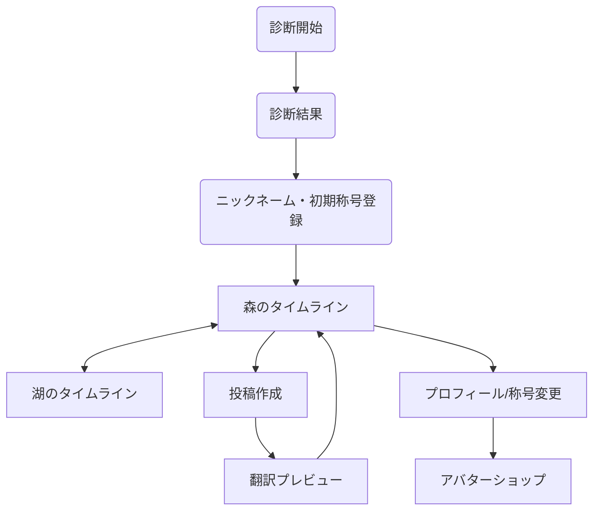

# UI/UX 設計書

## 1. デザインコンセプト
「日常の喧騒から離れ、自分を動物として投影できる穏やかな空間」
- **キーワード**: セージグリーン、角丸、独立した白いカード、点灯（数字のない繋がり）

## 2. デザインシステム

### カラーパレット
- **メイン（Brand）**: #B2AC88 (セージグリーン) - 背景やヘッダーに使用
- **アクセント（Point）**: #E3B448 (マスタードイエロー) - スタンプ点灯、称号、重要なアクション
- **ベース（Surface）**: #F9F9F7 (オフホワイト) - タイムラインの背景
- **カード（Paper）**: #FFFFFF (純白) - 投稿カード

### タイポグラフィ
- **フォント**: 
  - 日本語: 「Zen Maru Gothic」などの丸ゴシック（柔らかさを表現）
  - 数字/英字: シンプルなサンセリフ
- **制約**: ニックネームはひらがな・カタカナのみ。

## 3. 画面一覧と遷移図

### 画面一覧
1.  **診断画面**: 初回起動時の性格・動物診断。
2.  **空間タイムライン**: 「森」または「湖」の投稿一覧。
3.  **投稿作成画面**: テキスト入力、AI翻訳演出、プレビュー。
4.  **プロフィール/設定**: 称号変更、自分の過去の投稿履歴（原文確認トグル付き）、自分の動物人格確認。
5.  **管理者プロンプトエディタ**: プロンプト調整用（非一般ユーザー）。

### 画面遷移図


## 4. 主要画面ワイヤーフレーム（構成イメージ）

### タイムライン画面
（※タイムライン上では原文は一切表示されない）
...
+------------------------------+

### プロフィール画面（投稿履歴）
```
+------------------------------+
| [戻る]           [設定アイコン] |
+------------------------------+
|     (プロフィール情報)       |
+------------------------------+
|        [ 投稿履歴 ]          |
|                              |
|  [ 自投稿カード ]             |
|  +------------------------+  |
|  | [2026/01/08] [空間:森]  |  |
|  |                          |  |
|  | 「動物の言葉...」        |  |
|  |                          |  |
|  |      [ 翻訳を表示 ]      |  |
|  |   (押すと原文に切替)     |  |
|  +------------------------+  |
|                              |
+------------------------------+
```

### 投稿作成画面
```
+------------------------------+
| [キャンセル]       [次へ]    |
+------------------------------+
|                              |
|  今の気持ちを教えてください  |
|  +------------------------+  |
|  | (自由入力テキストエリア)|  |
|  +------------------------+  |
|                              |
|  ※あなたの言葉は動物の言葉に |
|    翻訳されて届きます。      |
|                              |
+------------------------------+
```

## 5. インタラクション方針
- **翻訳演出**: 「翻訳」ボタンを押した後、動物が手紙を書いていたり、森を歩いているような短いアニメーションを挟み、待機時間（AI処理）を「楽しみ」に変える。
- **リアクション**: アイコンをタップすると、ふわっとマスタードイエローの光が灯り、1秒ほどゆっくりと明滅して定着する演出。

