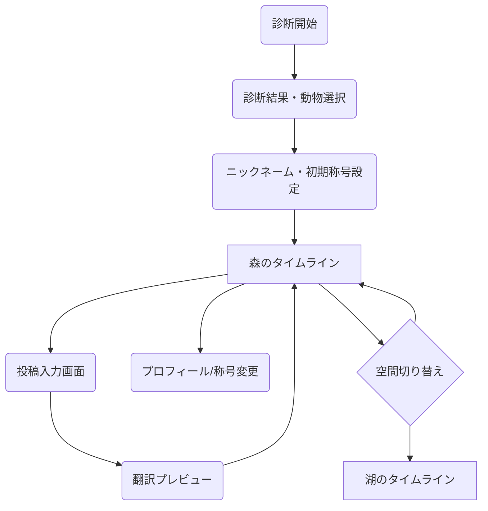
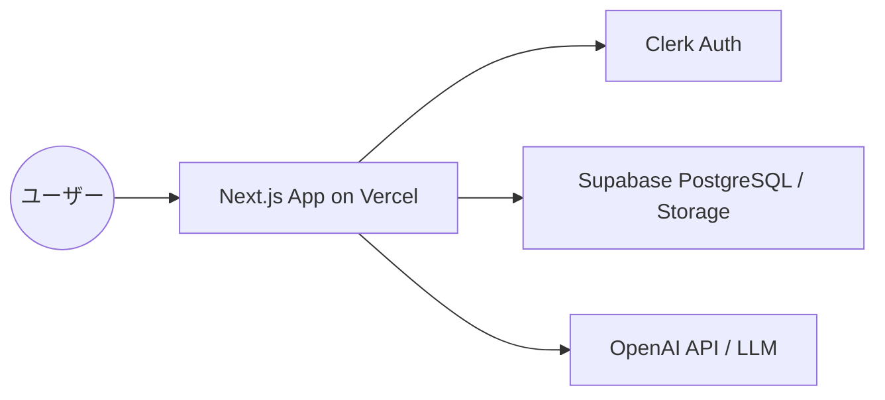
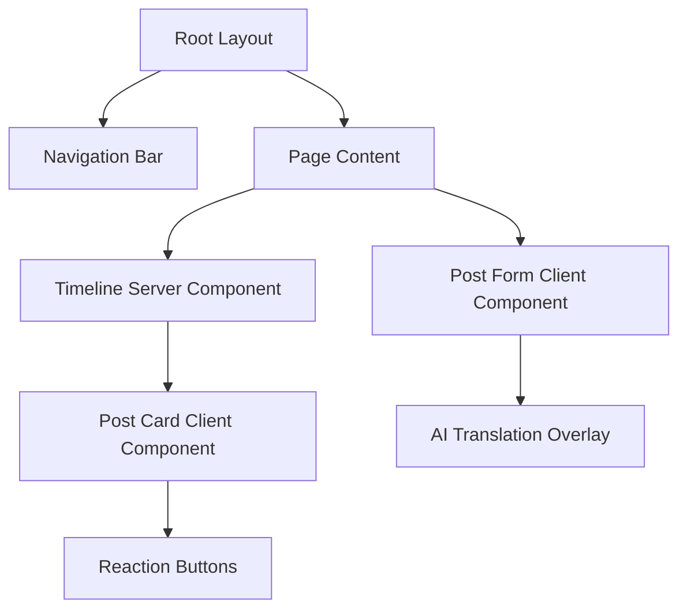

# 詳細要件定義書

## 1. プロジェクト概要
本プロジェクトは、人間の言葉をAIで「動物世界の言葉」に翻訳し、数値評価を排したSNS「動物世界SNS（仮）」を構築するものです。Next.js, Supabase, Clerk, およびOpenAI APIを活用し、日常のふとした瞬間に最適な、心理的安全性の高いコミュニケーション空間を提供します。

## 2. ビジネス要件
### 2.1 リーンキャンバス要約
- **課題**: 既存SNSの攻撃性、正論疲れ、数値比較によるストレス。
- **解決策**: AI翻訳による感情の昇華、非数値リアクション、称号成長システム。
- **主要指標 (KPI)**: DAU、投稿継続率、通報率の低さ。
- **収益の流れ**: 基本無料。アバター（動物種）課金、世界観調和型広告。

### 2.2 KPI/KGI
- **KGI**: 月間アクティブユーザー（MAU）の着実な成長と高い継続率。
- **KPI**:
  - 平均セッション時間（夜間帯）
  - 1人あたりの称号獲得数（エンゲージメント指標）
  - 投稿あたりの「しぐさ点灯」発生率

## 3. ユーザー要件
### 3.1 ペルソナ
- **サオリ (32歳)**: 事務職。日中の人間関係に疲れ、夜に一人で静かに本音を吐き出したい。
- **ミキ (25歳)**: デザイン系学生。可愛い世界観が好きで、数値競争のない平和なSNSを求めている。

### 3.2 ユーザーストーリー
1. ユーザーとして、今のイライラを動物の可愛いしぐさに変えて投稿し、心を浄化したい。
2. ユーザーとして、誰かの投稿に「のびをする」を送ることで、ゆるく繋がっている感覚を得たい。
3. ユーザーとして、特定の場所（森）で過ごし続けることで、自分だけの特別な称号を手に入れたい。

### 3.3 MVPの定義
- 診断による動物人格決定。
- LLMによる動物翻訳投稿（原文秘匿）。
- 「森」のタイムライン。
- 3種のしぐさリアクション（点灯のみ）。
- 基本的なプロフィール設定（初期称号選択）。

## 4. 機能要件
### 4.1 機能一覧 (MoSCoW)
- **Must Have**: AI翻訳エンジン、動物人格診断、白いカードUI、3種リアクション、称号選択。
- **Should Have**: タイムライン切り替え（森/湖）、称号自動解放ロジック。
- **Could Have**: 課金動物ショップ、季節連動UI。
- **Won't Have**: フォロワー数表示、いいね数、人間同士の直接コメント。

### 4.2 主要機能詳細仕様
#### AI動物翻訳投稿
- **ユースケース**: ユーザーが原文を入力し「翻訳」を押すと、選択中の動物の口調・世界観に沿った文章が生成される。
- **正常系**: 原文入力 → 翻訳待機（演出） → プレビュー確認 → 投稿完了。
- **例外系**: 不適切ワード検知時は「動物たちが少し驚いています」と表示し投稿不可。
- **閲覧制限**:
  - タイムライン: 投稿者本人を含め、全員に「翻訳後の文章」のみ表示。
  - プロフィール（本人）: 過去の自分の投稿に限り、ボタン押下で「原文」と「翻訳後」を切り替え可能。

#### 称号成長システム
- **ユースケース**: 内部実績（投稿数、リアクション数等）をトリガーに、ユーザーに通知なく称号リストを更新。
- **仕様**: `UserStats`テーブルで累積値を保持し、閾値を超えたら`UserTitles`テーブルにレコードを挿入。

## 5. UI/UX設計
### 5.1 デザインコンセプト
- **コンセプト**: 「夜の森の静寂と、月明かりの温かさ」
- **カラーパレット**:
  - メイン: セージグリーン (#B2AC88)
  - アクセント: マスタードイエロー (#E3B448) - 点灯・称号用
  - 背景: オフホワイト (#F9F9F7)
- **タイポグラフィ**: 柔らかい角丸の丸ゴシック。

### 5.2 画面遷移図


### 5.3 画面一覧
1. **診断画面**: 性格テスト。
2. **タイムライン（森/湖）**: 投稿カードが流れるメイン画面。
3. **投稿画面**: テキスト入力・翻訳演出。
4. **プロフィール画面**: 称号変更・動物人格確認。
5. **管理者用プロンプト設定**: 動物ごとのプロンプト調整。

## 6. 非機能要件
- **レスポンス**: AI翻訳以外は1秒以内。翻訳は5秒以内。
- **可用性**: Vercel/SupabaseのSLAに準拠。
- **セキュリティ**: Clerkによる認証。原文データのRDBMSレベルでの秘匿（RLSの徹底）。

## 7. データベース設計
### 7.1 ER図
```mermaid
erDiagram
    USERS ||--o1 ANIMAL_PROFILES : "has"
    USERS ||--o{ POSTS : "creates"
    USERS ||--o{ REACTIONS : "performs"
    USERS ||--o{ USER_TITLES : "earns"
    ANIMAL_PROFILES ||--o{ POSTS : "defined by"
    POSTS ||--o{ REACTIONS : "receives"
    TITLES ||--o{ USER_TITLES : "belongs to"
    ANIMAL_TYPES ||--o{ ANIMAL_PROFILES : "categorized by"

    USERS {
        uuid id PK
        string clerk_id
        string nickname
        uuid current_animal_profile_id FK
        timestamp created_at
    }
    POSTS {
        uuid id PK
        uuid user_id FK
        text original_content "Secret"
        text translated_content
        string space_type "forest/lake"
        timestamp created_at
    }
    REACTIONS {
        uuid id PK
        uuid post_id FK
        uuid user_id FK
        string type "tail/groom/stretch"
    }
    TITLES {
        uuid id PK
        string name
        string unlock_condition_type
        int threshold
    }
    PROMPT_TEMPLATES {
        uuid id PK
        string animal_type
        text prompt_text
    }
```

## 8. インテグレーション要件
### 8.1 API仕様 (REST形式)
- `POST /api/posts/translate`: 原文を送り、翻訳済みテキストを取得。
- `POST /api/posts`: 投稿を保存。
- `POST /api/reactions`: リアクションを実行（重複時はUPSERTし、状態を保持）。
- `GET /api/titles`: 獲得済み・選択可能な称号一覧を取得。

## 9. 技術選定とアーキテクチャ
### 9.1 アーキテクチャ概要図


### 9.2 コンポーネント階層図


## 10. リスクと課題
- **AIの暴走**: 不適切な変換やエラー。→ 厳格なシステムプロンプトと検閲レイヤー。
- **コスト**: OpenAIのAPI費用。→ gpt-4o-mini 等の低コストモデルの採用。

## 11. ランニング費用と運用方針
- **インフラ**: Vercel (Hobby/Pro), Supabase (Free/Pro), Clerk (Free/Pro)。
- **AI**: 月間投稿数に応じた従量課金（初期は月数千円程度と想定）。
- **運用**: 管理画面からのプロンプト調整、不適切投稿の監視。

## 12. 変更管理
- 本ドキュメントは、MVP開発中のフィードバックに基づき適宜更新される。

## 13. 参考資料
- [プロダクト定義書](../input/README.md)
- [システム要件定義書](./system_requirements.md)

