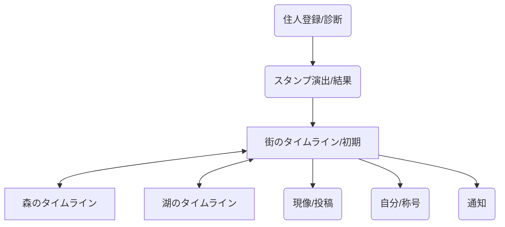

# 詳細要件定義書（ズートピア・エディション）

## 1. プロジェクト概要
本プロジェクトは、人間の役割や現実の肩書きを脱ぎ捨て、AIによって「動物世界の住人」として再定義されるSNSです。Next.js を活用し、自分自身のアイデンティティを浄化し、「街・森・湖」といったバイオームでの静かな社会生活を体験する空間を提供します。

## 2. ビジネス要件
### 2.1 目的
- **異世界への居住**: ユーザーが特定のバイオームの住人となり、その世界特有の日常を営む。
- **感情の昇華**: どんな感情もAI翻訳によって動物世界の美しい物語の一部として受け入れる。
- **脱・評価経済**: 繋がりよりも、自分の「すみか」を育み、称号を集めることに価値を置く。

### 2.2 主要指標 (KPI)
- 継続居住率（週次アクセス）
- 称号獲得の多様性
- 非言語リアクション（しぐさ点灯）の総数

## 3. ユーザー要件
### 3.1 ターゲット
- **世界観没入層**: 多種多様な生き物が共生する「ズートピア」のような世界の一員になりたい層。
- **アイデンティティ避難層**: 既存SNSの比較や正論に疲れ、別の自分（動物人格）として呼吸したい層。

### 3.2 ユーザーストーリー
1. ユーザーとして、住人登録（診断）を受け、自分にぴったりの動物の姿を授かりたい。
2. ユーザーとして、賑やかな「街」や静かな「森」を自由に散策し、その空気感を感じたい。
3. ユーザーとして、日々の出来事を動物の言葉として「現像（投稿）」し、誰かの反応（しぐさ）を静かに待ちたい。

## 4. 機能要件
### 4-1. 主要機能
- **住人登録（診断）**:
    - 数問の対話（質問）により最適な動物種を決定。
    - 最後にスタンプが押される「登録完了」の演出。
- **AI動物翻訳投稿（現像）**:
    - 入力テキストをバイオームに沿った言葉に変換。
    - 翻訳後の文章のみが公開され、原文はシステムから破棄（本人のみ確認可）。
- **バイオーム別タイムライン**:
    - **街ルーム**: メイン広場。社会の賑わい（ニュース）が混ざる。
    - **森ルーム**: 自然の移ろい（月明かり予報等）が混ざる。
    - **湖ルーム**: 静かな変化（水位の情報等）が混ざる。
- **非言語リアクション（しぐさ）**:
    - 3種（しっぽ、毛づくろい、のび）。数値非表示・アイコン点灯のみ。
- **称号成長システム**:
    - 行動実績に応じた称号解放。

### 4-2. システムメッセージ（バイオーム・ノイズ）
- ユーザーの投稿の合間に、リロードのたびにランダムで世界観を補強するニュースが挿入される。
- 例: 「中央通りの交通渋滞（街）」「今夜の月明かり予報（森）」「迷い込んだ渡り鳥（湖）」

## 5. UI/UX設計
### 5.1 ビジュアルコンセプト
- **オーガニック＆ソフト**: オフホワイト基調、セージグリーンのアクセント。
- **角丸の徹底**: 攻撃性を排除した柔らかなカードデザイン。
- **バイオーム別演出**: ルームごとに背景テクスチャや空気感が変化。

### 5.2 画面遷移図

## 6. 技術仕様（将来展望）
- **Frontend**: Next.js 15 (App Router), Tailwind CSS v4, Framer Motion.
- **Backend**: Supabase (PostgreSQL, Realtime), Clerk (Auth).
- **AI**: OpenAI API (gpt-4o-mini).
- **Data Persistence**: 現フェーズでは LocalStorage を活用し、フロントエンドの作り込みを優先。
